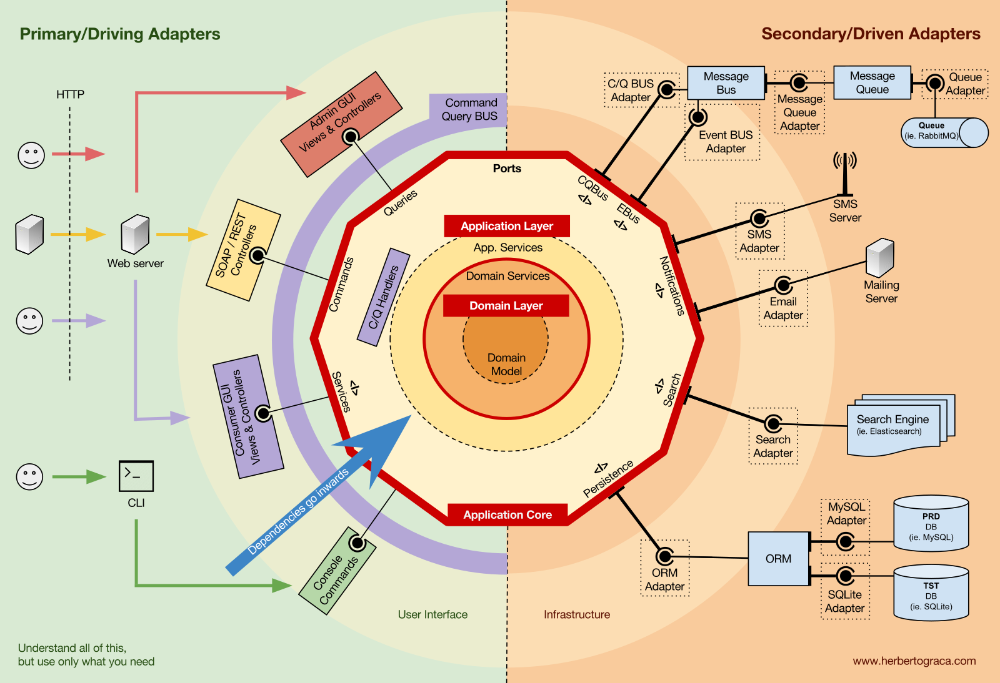

# Проектирование и дизайн приложения

## Приложение построено по принципу гексагональной архитектуры:



### Доменные модели
Доменная модель представляет собой модель предметной области, которая описывает основные понятия, понимание и логику бизнес-сущности.

В доменные модели были вынесены основные сущности приложения:
- Пользователь
- Сессия 
- Секрет
  - Данные типа K/V
  - Данные типа файл
  - Данные банковских карт

#### Доменные сервисы
Правила и процессы, которые являются основой функционирования системы. Они описывают ключевые понятия, атрибуты и операции, связанные с предметной областью, которую система предназначена поддерживать.

### Сервисы приложения
### Варианты использования
### Порты и адаптеры

## Клиент-серверное взаимодействие


## Структура базы данных Серверного приложения


## Организация директорий приложения
```
/bin
/cmd
    /client
    /server
/cert
/docs
    /images
/gen/
    /kv/v1
    /creditcrd/v1
    /file/v1
/internal
    /client
    /server
        /application
            /apperror
                /errors.go
                /handler.go
            /config
            /logger
            /type
            app.go
        /composites
            /grpc
        /domain
            /model
            /repository
            /service
        /infastructure
            /database
                /postgres
                    /migration
                    /query
                    /repository
            /objectstorage
            /grpc
                /interseptor
                /handler
                    /kv/v1
                    /creditcard/v1
                    /file/v1
/pkg
    /proto
        /kv/v1
        /creaditcard/v1
        /file/v1
/storage
```